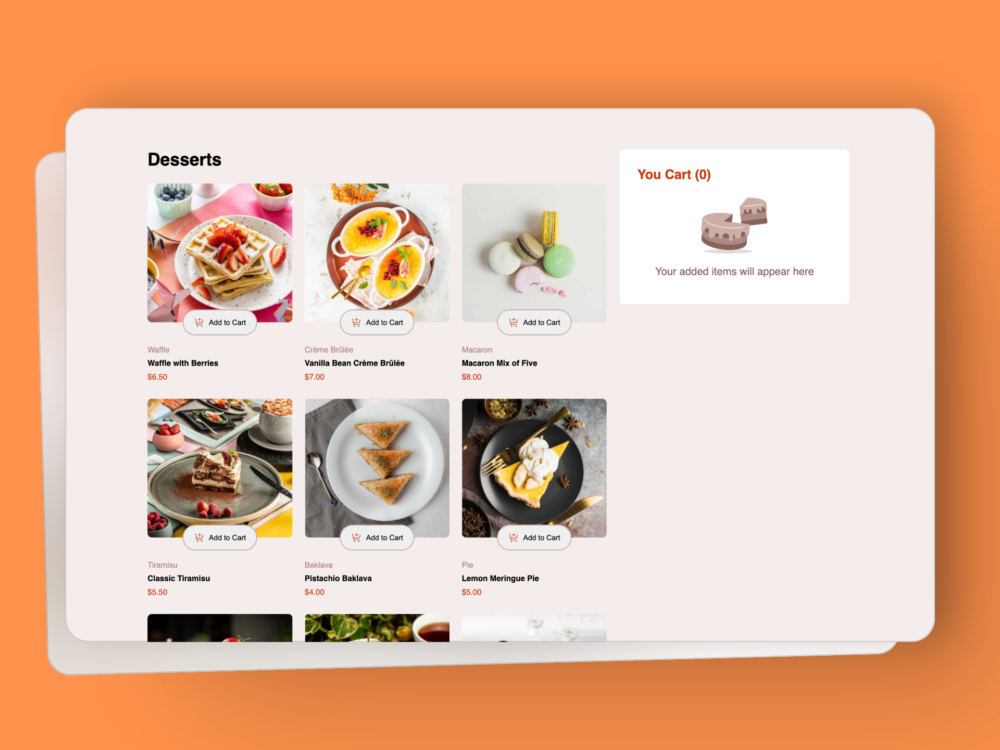
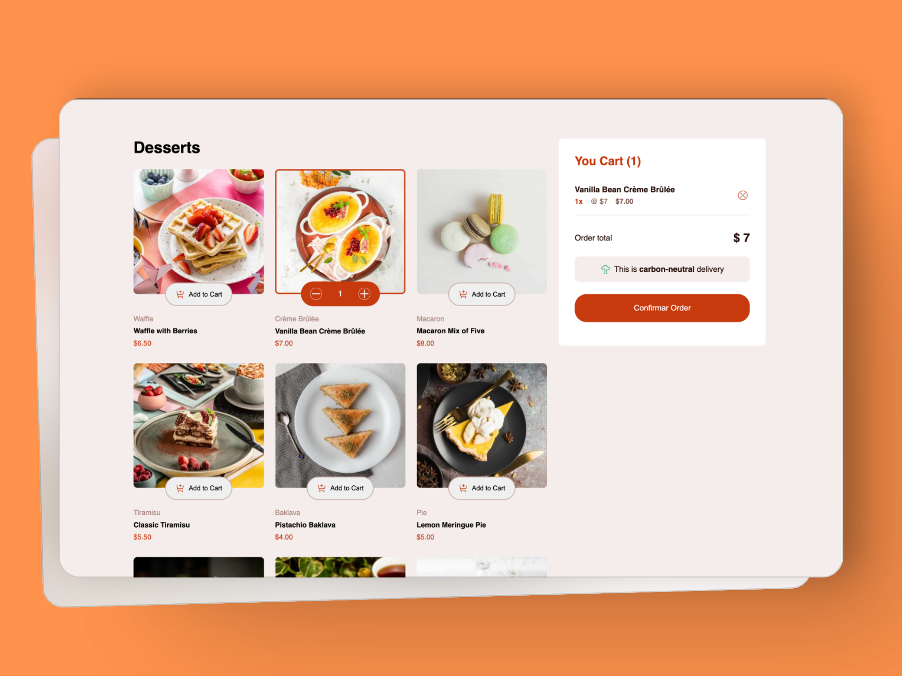

# PRODUCT LIST WITH CART MAIN

- This project is based on one of the [Frontend Mentor](https://www.frontendmentor.io/) challenges.

# Screenshots
  
  

### [Product list with cart](https://www.frontendmentor.io/challenges/product-list-with-cart-5MmqLVAp_d)

# Users should be able to:

- Add items to the cart and remove them
- Increase/decrease the number of items in the cart
- See an order confirmation modal when they click "Confirm Order"
- Reset their selections when they click "Start New Order"
- Navigate the whole project and perform all actions using only their keyboard
- View the optimal layout for the interface depending on their device's screen size
- See hover and focus states for all interactive elements on the page

# Technologies used

- Html
- Css
- Vue
- Vite
- Pinia
